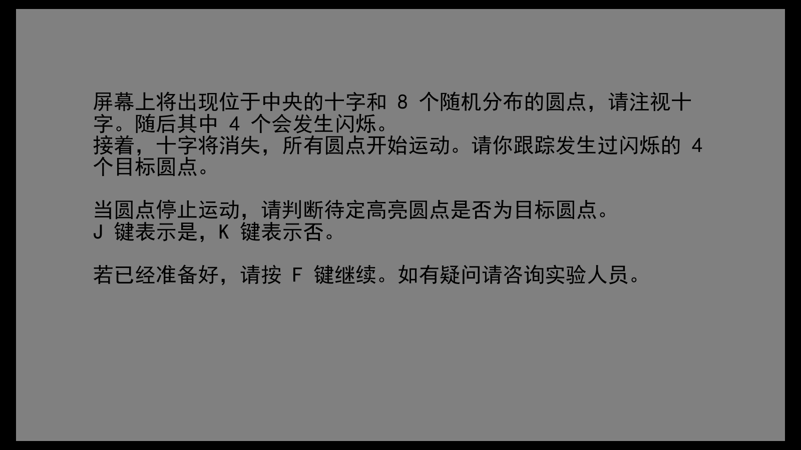
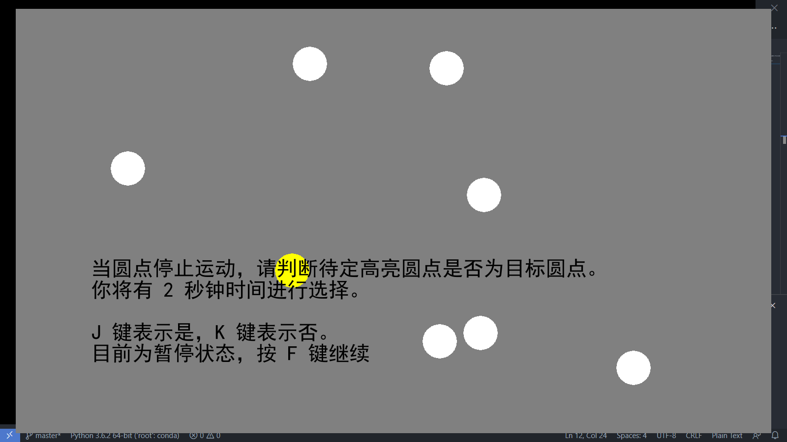

# 实验说明
- 本程序参照多目标追踪范式[1](#ref1)实现，被试需视线跟踪多个随机运动目标对象，运动停止后做出响应
- 实验分为三个部分，引导阶段，练习阶段，实验阶段
- 引导阶段进行实验规则说明
- 练习阶段和实验阶段流程相同
- 实验有可选两种响应操作，可通过`MOT_constants.py`中`mode`进行设置
  * 鼠标点选所有目标点：`mode = 'select'`
  * 判断特定待选点是否为目标点：`mode = 'judge'`

# 使用说明
- 安装 python 3.x （最好是3.6）
- 依赖 pygame `python -m pip install -U pygame --user -i https://pypi.douban.com/simple/`
- 解压后进入项目目录，运行程序 python MOT.py （被试编号），如 `python MOT.py cwg`
- Windows下可自动获取分辨率，非 Windows 用户请在 MOT_constants.py 文件中自行设置
- 实验过程中想提前退出请在物体运动状态下按esc

引导语

待选点判别

<a name="ref1">[1]</a>: PYLYSHYN Z W, STORM R W. Tracking multiple independent targets: Evidence for a parallel tracking mechanism[J]. Spatial Vision, 1988, 3(3): 179–197. DOI:10.1163/156856888X00122.
